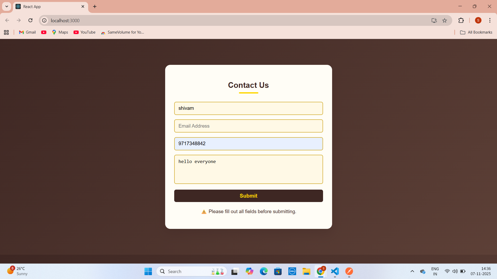
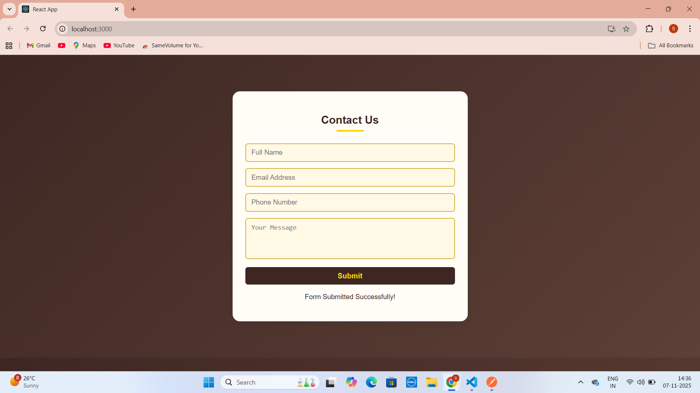
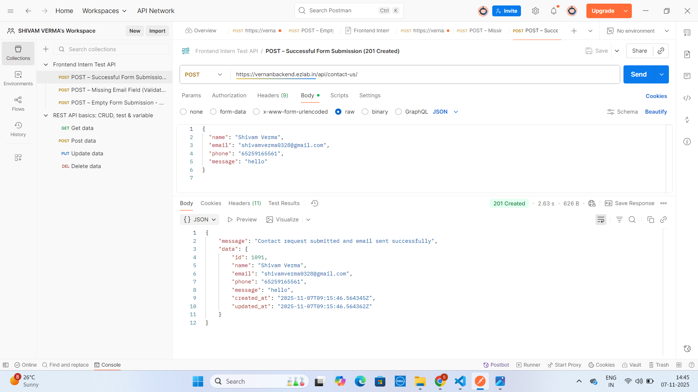

# 🧠 Front-End Internship Test – React Form Integration

## 👨‍💻 Developer
**Name:** Shivam Verma  
**Task:** Front-End Internship Test  
**Date:** November 2025  

---

## 🚀 Project Overview

This is a **single-page React application** created as part of the Front-End Internship Test.  
The application includes a **responsive Contact Form** that integrates with the provided API endpoint to submit form data.

---

## 🧩 Tech Stack

- **React.js** (v19.2.0)
- **HTML5 / CSS3**
- **JavaScript (ES6+)**
- **Postman** for API testing
- **Node.js + npm**

---

## 🎨 Features

✅ Responsive and clean UI  
✅ Yellow & Dark Brown theme  
✅ Real-time form validation  
✅ Email format validation  
✅ Prevents empty form submission  
✅ API integration with backend  
✅ Displays success and error messages dynamically  

---

## ⚙️ API Integration

**Base URL:**
https://vernanbackend.ezlab.in/api/contact-us/

**Method:** `POST`  
**Headers:**

Content-Type: application/json

**Request Body Example:**
```json
{
  "name": "Shivam Verma",
  "email": "shivamverma0328@gmail.com",
  "phone": "65259165561",
  "message": "hello"
}
```

**Successful Response (201 Created):**
```json
{
  "message": "Contact request submitted and email sent successfully",
  "data": {
    "id": 1004,
    "name": "Shivam Verma",
    "email": "shivamverma0328@gmail.com",
    "phone": "65259165561",
    "message": "hello",
    "created_at": "2025-11-07T08:06:39.591394Z",
    "updated_at": "2025-11-07T08:06:39.591411Z"
  }
}
```


## Postman Collection 

A Postman dump is included in this repository:
📁 postman_collection.json

Contains:

✅ Valid request

⚠️ Missing field (email)

❌ Empty body (returns validation errors)


## 📸 Screenshots

### 🧾 Form UI  


---

### ⚠️ Required Field Validation  




---

### ✅ Successful Submission  



---

### 🧪 Postman Response  





